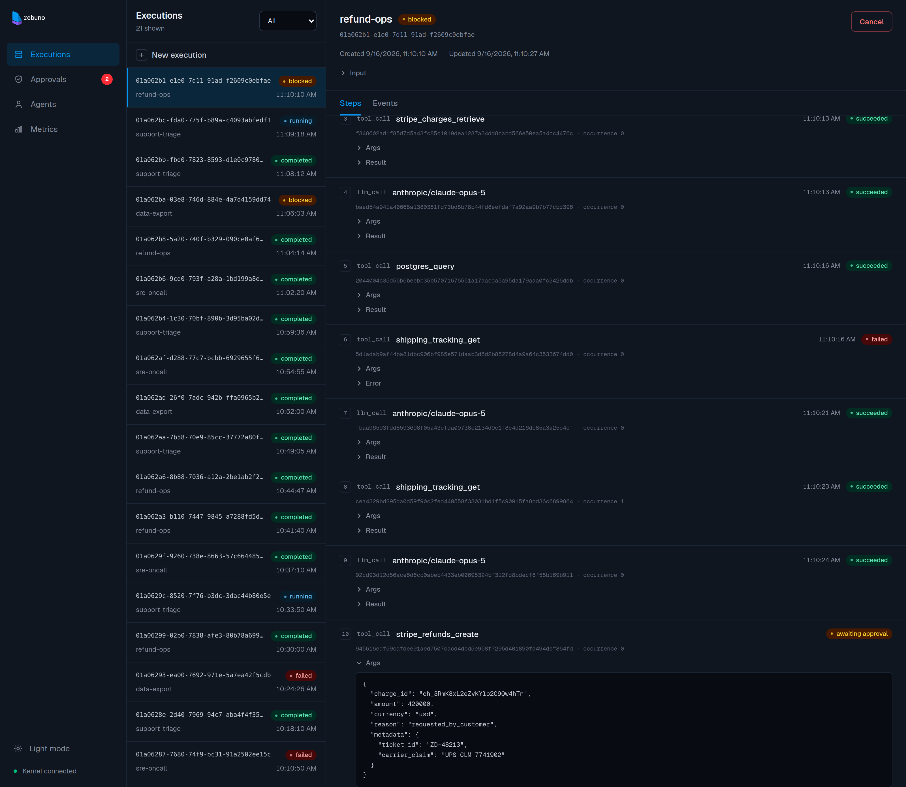
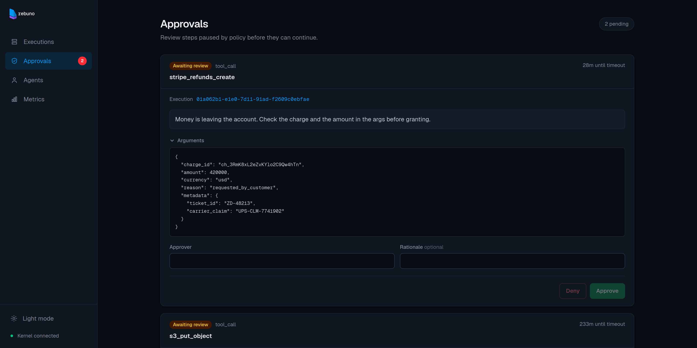
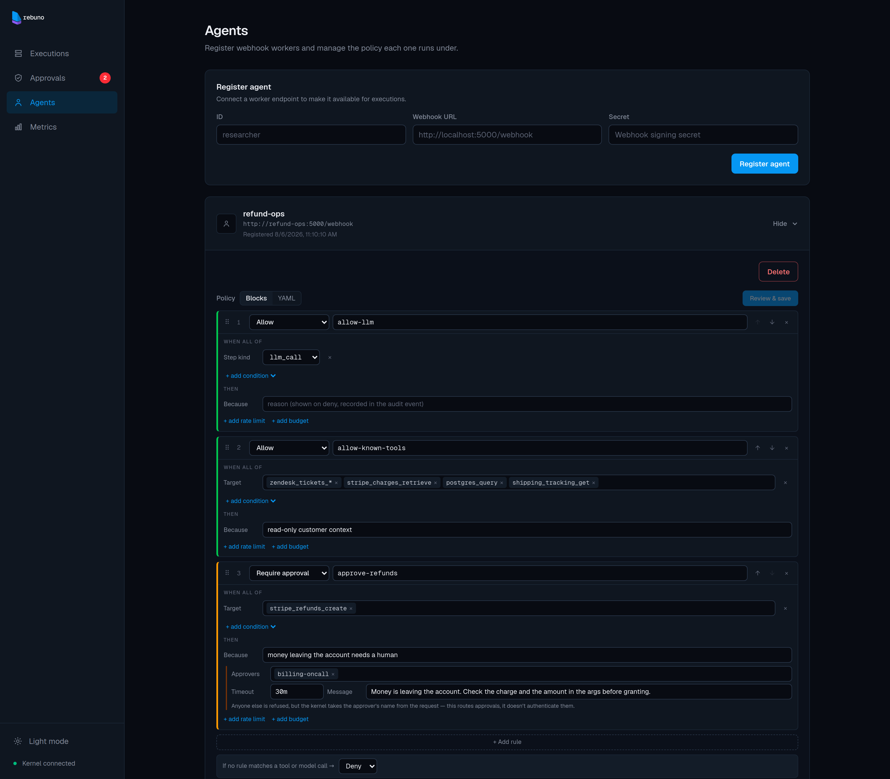
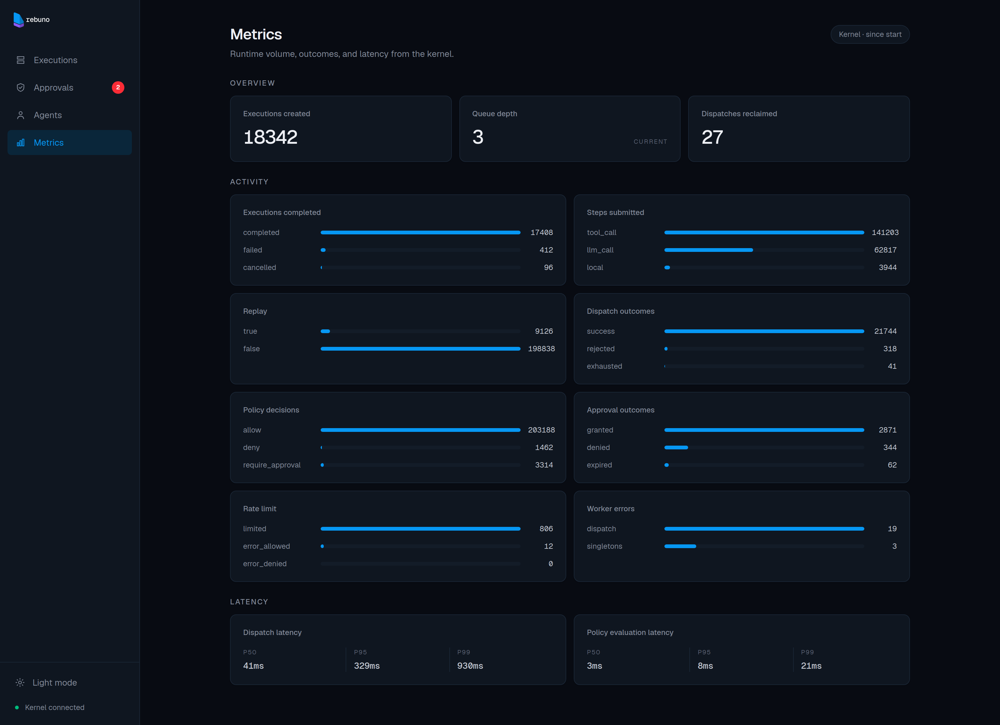

# Rebuno Dashboard

Web UI for [Rebuno](https://github.com/rebuno/rebuno), an open-source execution
runtime for production agents. Inspect executions, register agents, resolve
approvals, and watch kernel metrics.

Built with Next.js, React, and Tailwind CSS.

<p align="center">
  
</p>

## Executions


## Approvals


## Agents



## Metrics


## Development

```bash
pnpm install
pnpm dev
```

Requires Node 24 and a running Rebuno kernel.

| Variable | Default | Purpose |
|----------|---------|---------|
| `REBUNO_URL` | `http://localhost:8080` | kernel base URL |
| `REBUNO_API_KEY` | none | bearer token for the kernel's client and admin routes |
| `PROMETHEUS_URL` | none | metrics source; without it the metrics page reads the kernel's own counters |

## Scripts

| Command | Description |
|---|---|
| `pnpm dev` | Start the dev server |
| `pnpm build` | Production build |
| `pnpm start` | Serve the production build |
| `pnpm test` | Run the test suite with Vitest |
| `pnpm typecheck` | Type-check with tsc |
| `pnpm lint` | Check formatting and lints with Biome |
| `pnpm format` | Apply Biome fixes |

## Documentation

[Dashboard](https://github.com/rebuno/rebuno/blob/main/docs/dashboard.md): what
each page does, how it reaches the kernel, and how to deploy it.

## License

[MIT](LICENSE)
